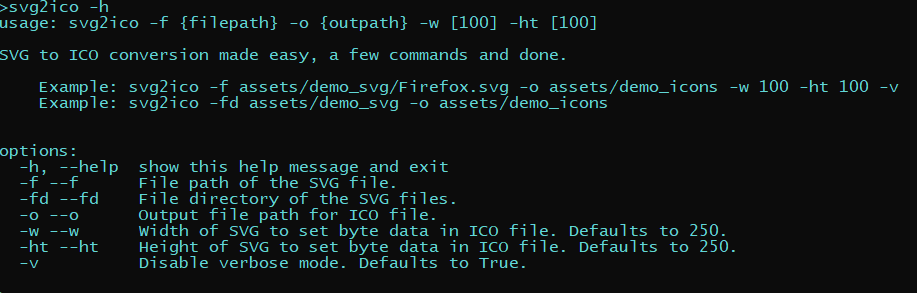
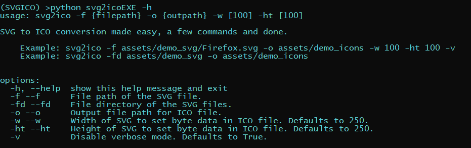
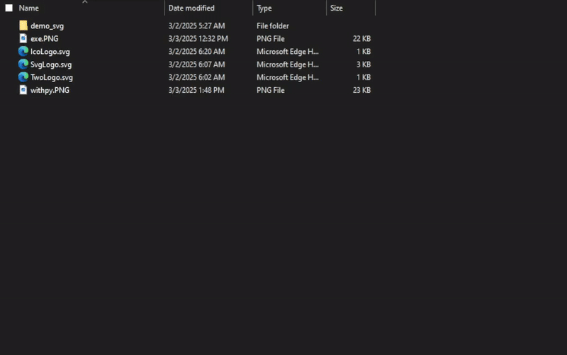

# SVG to ICO

<p align='center'>


</p>

> <p align='center'>SVG to ICO (Icons) file/s, conversion made super simple.</p>

## Table of Contents
- [Repository Structure](#repo-structure)
- [Installation](#installation)
    - [Dependancies](#dependencies)
    - [USING EXE](#EXE)
- [Usage Demo](#example-usage)
    - [EXE Cli](#exe-cli)
    - [Python Cli](#python-cli)
    - [Module/Package](#modulepackage)
    - [Batch Script](#batch-script)
- [Releases](#releases)
- [Author](#author)
- [Support](#support)
- [License](#license)

## Repo structure

- **`assets`**: Demo and README.md materials.
    - demo icons: Converted SVG's to ICO.
    - demo svg: Directory with some SVG's for demo.
- **`svg2icoEXE`**: Where all the scripts are located.
    - assets: ICO used for EXE icon.
    - dist: Location of EXE.
- **`setup.py`**: Use `ONLY` if you decide you want to use `EXE` otherwise follow steps in [Installation](#noEXE) guide. Creates a setup_log.txt for details of setup.
- License, Issues, and README mds.
## Installation
<p align='center'>Built for Windows, with python 3.12+</p>

Clone the repo:
```
git clone https://github.com/teslonobo/SVG-to-ICO.git
```
#### If you decide to use <a id='noEXE'></a>EXE the next steps can be skipped [click here](#EXE) to advance to final step.

<p align='center'><a id='dependencies'></a> Dependencies</p>

Using conda create our {venv name} and choose our {python version}:
```sh
conda create --name {venv name} python={py version}
```
Next activate it:
```sh
conda activate {Virtual Environment}
```
Once activated:
```sh
conda install -c conda-forge cairo cairosvg librsvg pyinstaller
```
After VENV is activated we will want to create an EXE.

- Change into svg2icoEXE:
    ```
    cd svg2icoEXE
    ```
- Second use the .spec sheet:
    ```
    pyinstaller SVG2ICO.spec
    ```
<a id='EXE'></a>If deciding to use packaged EXE or after creating one yourself call the following in the terminal:
```
python setup.py
```
Sets up User Environment Variable and sets REG keys to use like <a href='#batch-script'>Batch Script</a> example, after completion `setup_log.txt` is created with detailed information on setup. If `setup.py` is skipped then you can only use <a href='#python-cli'>Python Cli</a> and <a href='#modulepackage'>Module/Package</a>.
## Example Usage

- ### EXE Cli:
    Open cmd/powershell from directory:
    ~~~sh
    svg2ico -h
    ~~~
    

- ### Python Cli:
    Open cmd/powershell from directory activate VENV:
    ~~~sh
    python svg2icoEXE -h
    ~~~
    

- ### Module/Package:
    ```python
    # Import SVG2ICO class from svg2icoEXE
    from svg2icoEXE import SVG2ICO

    # Single File Process
    file = os.path.normpath('assets/demo_svg/Firefox.svg') # Demo SVG File
    o_p = os.path.normpath('assets/demo_icons')

    SVG2ICO(file,o_p).save_ico()

    # Batch Process
    f_p = os.path.normpath('assets/demo_svg') # Demo SVGS Directory
    o_p = os.path.normpath('assets/demo_icons')
    files = [os.path.join(f_p,f) for f in os.listdir(f_p)]

    for f in files:
        SVG2ICO(f,o_p).save_ico()
    ```

- ### Batch Script
    > This is probably the coolest way to use this. `MUST` of used setup.py for it to work properly.

    

    Another way to use it is Drag&Drop folder/file you want to convert into `s2i.bat` file.

## Releases
- v0.01:
    - Initial Release

## Author
- [Teslonobo](https://github.com/teslonobo)

## Support
If you need assistance:
1. **Report Issues**: Use the [Issues](Issues.md) template to report bugs, suggest features, or ask questions.
2. **Reach Out**: Contact the [repository maintainer](https://github.com/teslonobo) for direct support.


## License
This project is licensed under the MIT License - see the [LICENSE](LICENSE.md) file for more details.

### Third Party Licenses
- [Cairo](https://www.cairographics.org/): GNU Lesser General Public License (LGPL) version 2.1 or the Mozilla Public License (MPL) version 1.1.

- [CairoSVG](https://github.com/Kozea/CairoSVG/blob/main/LICENSE): GNU Lesser General Public License (LGPL) version 3.

- [librsvg](https://en.wikipedia.org/wiki/Librsvg): GNU General Public License (GPL) version 2 and the GNU Lesser General Public License (LGPL) version 2.

- [PyInstaller License](https://pyinstaller.org/en/stable/license.html): GPL 2.0 License and the Apache License, version 2.0.
